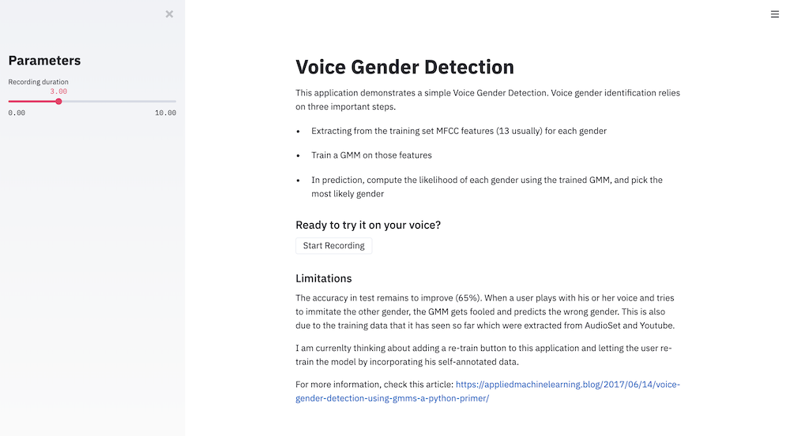

# Voice Gender Detection

This application demonstrates a simple Voice Gender Detection. Voice gender identification relies on three important steps.

- Extracting from the training set MFCC features (13 usually) for each gender
- Train a GMM on those features
- In prediction, compute the likelihood of each gender using the trained GMM, and pick the most likely gender

## Re-train the algorithm

The notebook contains the training code and the generation of the `male.gmm` and `female.gmm` files. You can just run the code of the notebook to retrain them.

⚠️ The dataset has been extracted from [AudioSet](https://research.google.com/audioset/dataset/index.html) as expalined in [this article](https://appliedmachinelearning.blog/2017/06/14/voice-gender-detection-using-gmms-a-python-primer/) and can be downloaded from [here directly](https://drive.google.com/file/d/1g64EswaS5PtwIg-Y0ZmWwvSK1DgYvUuc/view?usp=sharing).

## Try the application

To run the application locally, simply run:

```bash
streamlit run app.py
```

Otherwise, I'm currently publishing it online with Render.



## Limitations

The accuracy in test remains to improve (65%). When a user plays with his or her voice and tries to immitate the other gender, the GMM gets fooled and predicts the wrong gender. This is also due to the training data that it has seen so far which were extracted from AudioSet and Youtube.